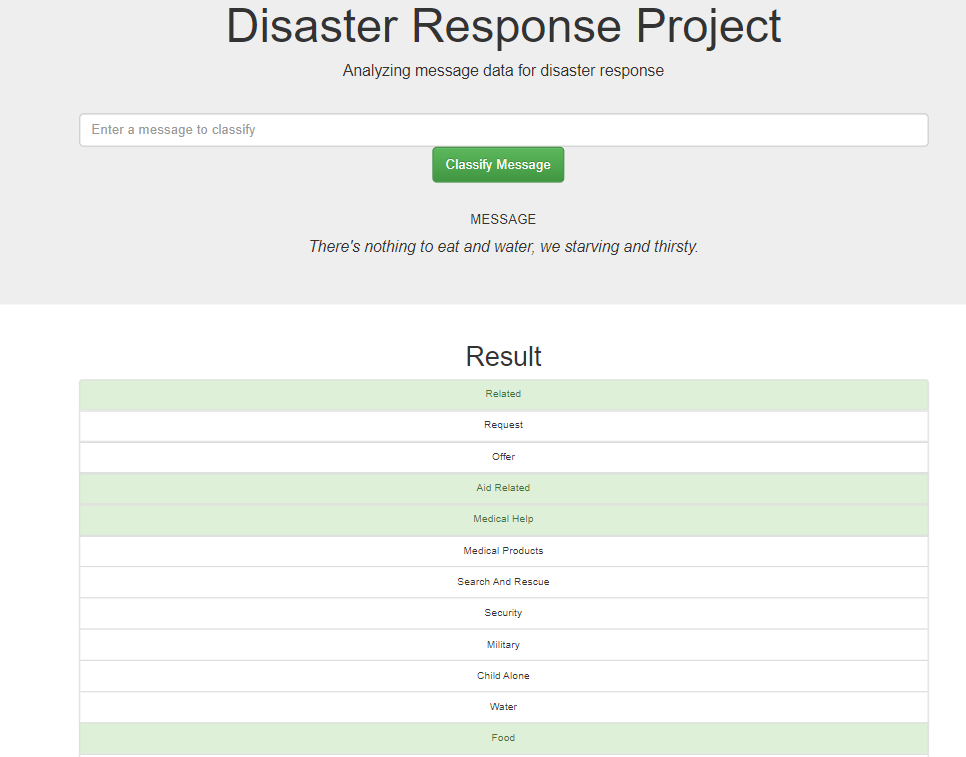

# Disaster Response Pipeline Project

### Table of Contents

1. [Installation](#installation)
2. [Project Motivation](#motivation)
3. [File Descriptions](#files)
4. [Project Components](#components)
5. [Results](#results)
6. [Licensing, Authors, and Acknowledgements](#licensing)

## Installation 

Follwing are the nesesary libraries required for this project.
### Libraries used:
    1. Flask==0.12.5
    2. json5==0.8.5
    3. nltk==3.2.5
    4. pandas==0.23.3
    5. pickleshare==0.7.4
    6. plotly==2.0.15
    7. scikit-learn==0.19.1
    8. SQLAlchemy==1.2.19

    
The code should run with no erros using Python versions 3.9.3.

## Project Motivation

Natural Distaster had caused a lot of troubles for many people. Recently, Wildfire had left many people homeless in California. During natural disasters, there are millions of tweets and text messages were sent to disaster response organizations either via social media or direct. 

Once Disater Management Organization receives a message/text/tweet, it is very important for them to classify the message and provide aid to the people in need accordingly. 

Figure Eight Platform, currenty known as <a name="appen" href="https://appen.com/"> appen</a>, has provided the dataset of messages and tweets sent during natual disaters. 

I have analysed pre-labelled tweets and text messages from real life disaters provided by <a name="appen" href="https://appen.com/"> appen</a> and built an ML pipeline that classifies the messages into 36 different categories. I have developed  a web app through which Disaster Management Organizations can search a message and classifies the message into any of 36 categories.

## File Descriptions 

### - app/ template/
    
        - master.html  # main page of web app
        - go.html  # classification result page of web app
### - app/
    
        - run.py  # Flask file that runs app

### - data/
    
        - disaster_categories.csv  # data to process 
        - disaster_messages.csv  # data to process
        - process_data.py # script to perform ETL on the data and 
        store the transformed data into a SQLite database. 
        - DisasterResponse.db   # database to save clean data to

### - models/
    
        - train_classifier.py
        - classifier.pkl  # saved model 

## Project Components 
There are three components in this project.

#### 1. ETL Pipeline
Python script, `process_data.py`, contains data cleaning pipeline that:

    Loads the messages and categories datasets
    Merges the two datasets
    Cleans the data
    Stores it in a SQLite database

#### 2. ML Pipeline
Python script, `train_classifier.py`, contains machine learning pipeline that:
    
    Loads data from the SQLite database
    Splits the dataset into training and test sets
    Builds a text processing and machine learning pipeline
    Trains and tunes a model using GridSearchCV
    Outputs results on the test set
    Exports the final model as a pickle file
    
#### 3. Flask Web App
A web app where an emergency worker can input a new message and get classification results in several categories. The web app will also display visualizations of the data.

## Instructions:
1. Run the following commands in the project's root directory to set up your database and model.

    - To run ETL pipeline that cleans data and stores in database
        `python data/process_data.py data/disaster_messages.csv data/disaster_categories.csv data/DisasterResponse.db`
    - To run ML pipeline that trains classifier and saves
        `python models/train_classifier.py data/DisasterResponse.db models/classifier.pkl`

2. Run the following command in the app's directory to run the web app.
    `python run.py`

3. Go to http://0.0.0.0:3001/

## Web App Screenhots

## Licensing, Authors, Acknowledgements

